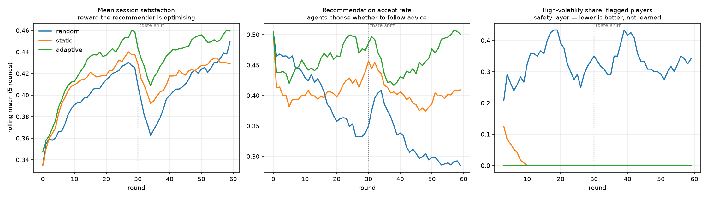

# ai-player-behaviour
This project models player interaction patterns using synthetic data and applies machine learning techniques to cluster behaviour profiles and recommend suitable game experiences. It demonstrates behavioural analytics, clustering, feature engineering, and similarity-based recommendation systems.

The goal is to showcase a safe, generalised approach to modelling user
engagement patterns and matching them with content categories. No real gambling
data is used, and the system is designed purely for research, simulation, and
portfolio demonstration.

## Features
- Synthetic player behaviour dataset generator
- Behaviour feature engineering and preprocessing
- Clustering using scikit-learn (K-means, PCA visualisation)
- Experience embedding model — *specified in `src/embedding_model.py`, not yet implemented*
- Cosine-similarity recommendation engine
- Playable slot machine environment (same RTP-calibrated maths as the dataset)
- Population of learning AI agents that play it and generate data by interacting
- Adaptive recommender (hybrid LinUCB contextual bandit) that learns online,
  benchmarked against random and static-cosine baselines
- Interactive dashboard (Streamlit) — *currently broken, see `dashboard/app.py`*
- Clear architecture and documentation for portfolio presentation

## Two loops

**Offline** — `generate_synthetic_data.py` rolls a dataset in one shot, and the
rest of the pipeline (features → clustering → risk scoring → cosine
recommendations) reads the CSVs it leaves behind.

**Online** — `slot_machine.py` turns the same payout maths into a live
environment; `agents.py` puts a population of learning players in front of it;
`play_loop.py` runs them round after round while `adaptive_recommender.py`
learns from what happens. The data is produced *by* the interaction, so a
recommender that changes its advice also changes the behaviour it will observe
next — something no offline replay can show you.

```bash
pip install -r requirements.txt

# spin it yourself
python src/slot_machine.py --list
python src/slot_machine.py --play --game game_08 --bankroll 200 --bet 2

# check the machine pays what the catalogue claims
python src/slot_machine.py --audit --spins 200000

# 40 agents x 60 rounds x 3 policies, repeated over 6 seeds
python src/play_loop.py --agents-per-persona 8 --rounds 60 --seeds 7 11 23 31 47 59

# the arena's output is drop-in for the offline pipeline
python src/feature_engineering.py --data-dir data/arena --out-dir data/arena
python src/responsible_play.py --features_raw_path data/arena/player_features_raw.csv --out_dir data/arena
```

### What the arena measures

All three policies face identical agents on an identically seeded machine, so
the difference between rows is caused by the policy. Pooled over 6 seeds,
40 agents, 60 rounds (satisfaction is the session-quality reward defined in
`agents.py`, in [0, 1]):

| policy | satisfaction | accept rate | high-volatility recs to flagged players |
|---|---|---|---|
| random | 0.406 | 0.36 | 0.33 |
| static cosine | 0.416 | 0.41 | 0.004 |
| adaptive (LinUCB) | **0.435** | **0.46** | **0.00** |



Left: the adaptive policy stays above both baselines and recovers fastest from
the mid-run taste shift at round 30. Middle: agents increasingly follow its
advice while abandoning random. Right: the safety layer holds high-volatility
recommendations to risk-flagged players at zero.

Adaptive beats static by +0.019 satisfaction/session, ahead on 6/6 seeds. Two
honest caveats: the gap is small next to the 0.22 of headroom that a perfect
recommender would capture, and most of the *round-over-round* improvement is
the agents learning their own tastes — it happens under random recommendations
too, which is exactly why the baselines are there.

The reward being optimised is deliberately session quality from the player's
side — taste fit, session length, bonus excitement — with penalties for busting
out and for chasing losses. It is not time-on-device or amount wagered.
Risk-flagged players get high-volatility games downweighted by a hard
constraint outside the objective, because anything that must hold regardless of
reward does not belong in a reward a bandit is free to trade against.

## Purpose
This project is intended as a portfolio piece to demonstrate skills in:
- Machine learning engineering
- Behaviour modelling
- Recommendation systems
- Data visualisation
- Python backend development
- Interactive dashboards

It is **not** intended for deployment in any gambling environment and complies
with responsible AI and safe modelling principles.